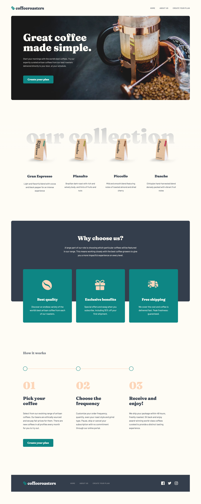

# Coffeeroasters subscription

This is a solution to the [coffeeroasters subscription site challenge on Frontend Mentor](https://www.frontendmentor.io/challenges/coffeeroasters-subscription-site-5Fc26HVY6). Frontend Mentor challenges help you improve your coding skills by building realistic projects.

## Table of contents

- [The challenge](#the-challenge)
- [Screenshot](#screenshot)
- [Links](#links)
- [Built with](#built-with)
- [Author](#author)

### The challenge

Users should be able to:

- View the optimal layout for each page depending on their device&#8217;s screen size
- See hover states for all interactive elements throughout the site
- Make selections to create a coffee subscription and see an order summary modal of their choices

### Expected bahaviour

The interactive subscription page has a number of specific behaviours, which are listed below:

- If "Capsule" is selected for the first option
  - The "Want us to grind them?" section should be disabled and not able to be opened
- Order summary texts updates
  - If "Capsule" is selected, update the order summary text to:
    - "I drink my coffee **using** Capsules"
    - Remove the grind selection text
  - If "Filter" or "Espresso" are selected, update the order summary text to:
    - "I drink my coffee **as** Filter||Espresso"
    - Keep/Add the grind selection text
  - For all other selections, add the selection title in the blank space where appropriate
- Updating per shipment price (shown in "How often should we deliver?" section at the bottom) based on weight selected
  - If 250g weight is selected
    - Every Week price per shipment is $7.20
    - Every 2 Weeks price per shipment is $9.60
    - Every Month price per shipment is $12.00
  - If 500g weight is selected
    - Every Week price per shipment is $13.00
    - Every 2 Weeks price per shipment is $17.50
    - Every Month price per shipment is $22.00
  - If 1000g weight is selected
    - Every Week price per shipment is $22.00
    - Every 2 Weeks price per shipment is $32.00
    - Every Month price per shipment is $42.00
- Calculating per month cost for the Order Summary modal
  - If Every Week is selected, the Order Summary modal should show the per shipment price multiplied by 4. For example, if 250g weight is selected, the price would be $28.80/month
  - If Every 2 Weeks is selected, the Order Summary modal should show the per shipment price multiplied by 2. For example, if 250g weight is selected, the price would be $19.20/month
  - If Every Month is selected, the Order Summary modal should show the per shipment price multiplied by 1. For example, if 250g weight is selected, the price would be $12.00/month

## Screenshot

## Links

- [Solution URL](https://github.com/annaindistress/frontend-mentor-coffeeroasters-subscription)
- [Live Site URL](https://annaindistress.github.io/frontend-mentor-coffeeroasters-subscription/)

### Built with

- Semantic HTML5 markup
- Mobile-first workflow
- CSS custom properties
- Vite
- React
- React Router
- Redux Toolkit
- Framer Motion
- styled-components

## Author

- Frontend Mentor - [@annaindistress](https://www.frontendmentor.io/profile/annaindistress)
